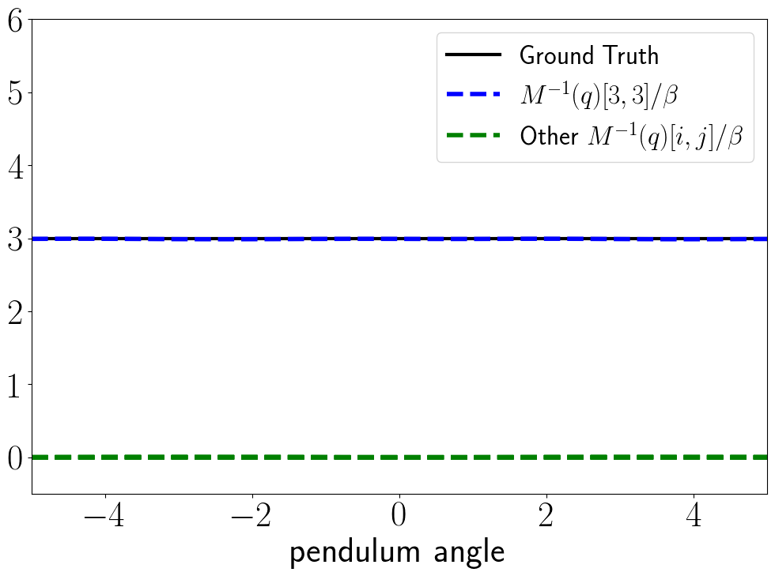
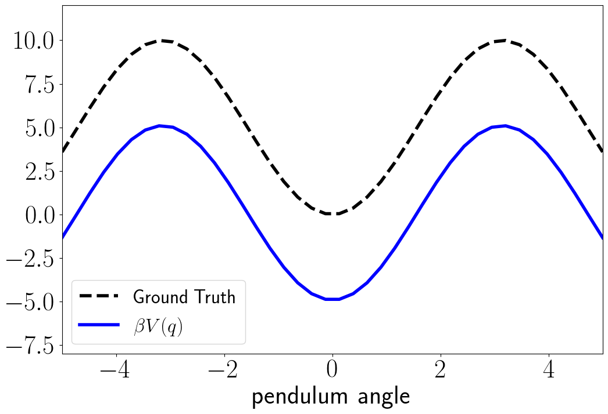
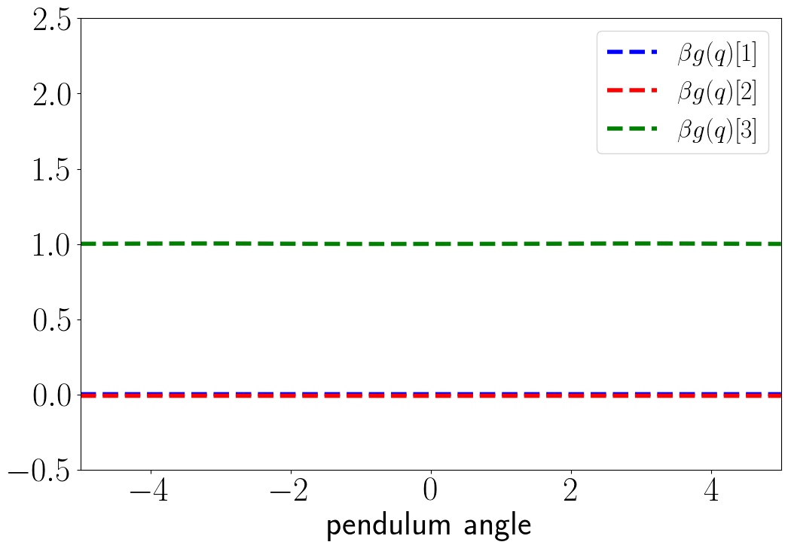
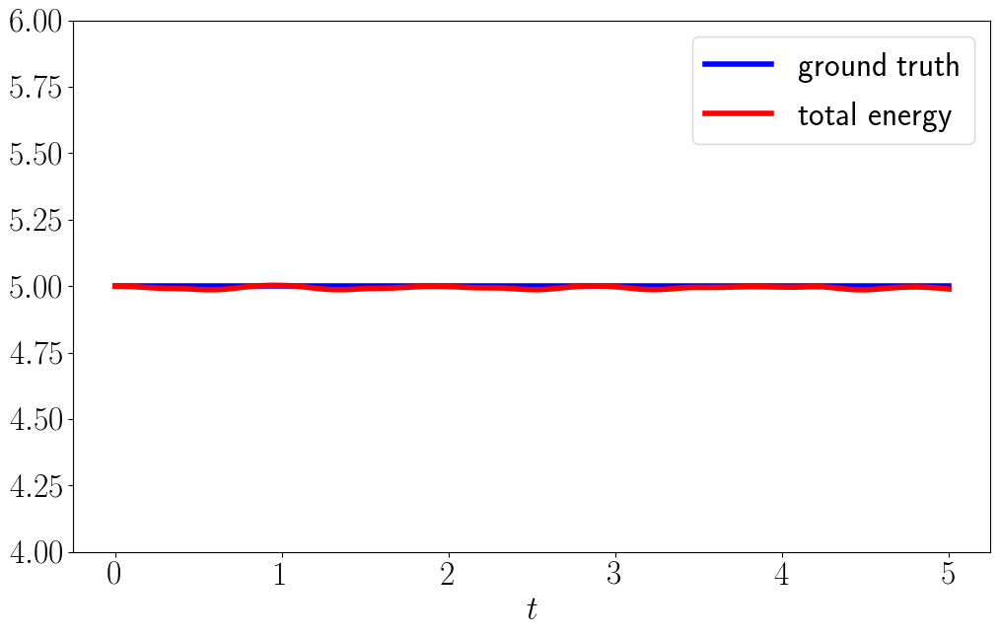
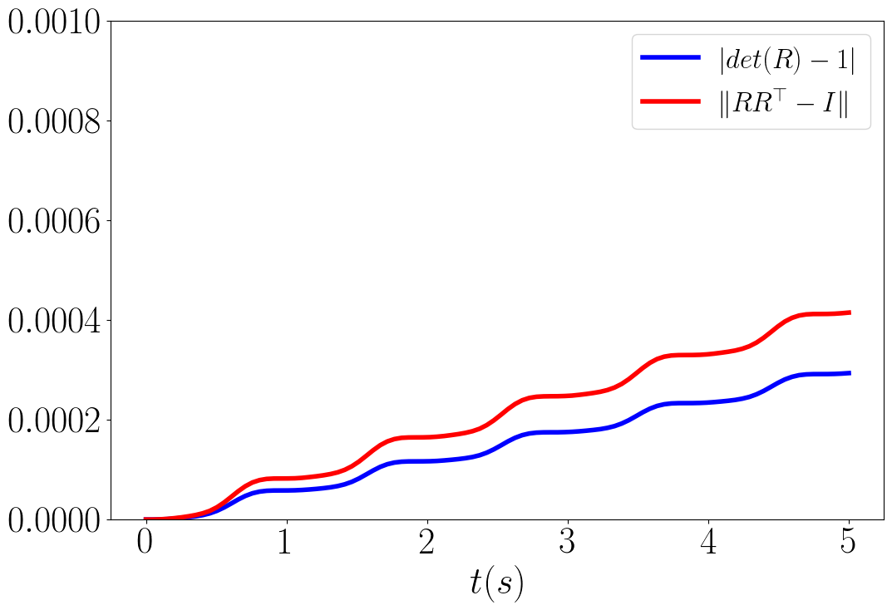
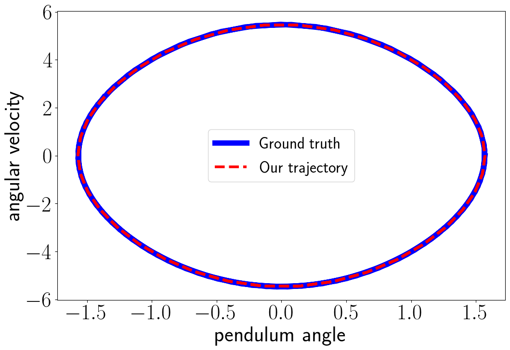

# Hamiltonian-based Neural ODE Networks on the SE(3) Manifold For Dynamics Learning and Control
This repo provides code for our paper "Hamiltonian-based Neural ODE Networks on the SE(3) Manifold For Dynamics Learning and Control".
Please check out our project website for more details: https://thaipduong.github.io/SE3HamDL/.

TODO: Release code for quadrotor demo. 

## Dependencies
Our code is tested with Ubuntu 18.04 and Python 3.7. It depends on the following Python packages: 

```torchdiffeq 0.1.1```

```gym 0.18.0```

```torch 1.4.0```

```numpy 1.20.1```

```scipy 1.5.3```

```matplotlib 3.3.4```

## Demo with pendulum
Run ```python ./examples/pendulum/train_pend_SO3.py``` to train the model with data collected from the pendulum environment. It might take some time to train. A pretrained model is stored in ``` ./examples/pendulum/data/pendulum-so3ham_ode-rk4-5p.tar ```

Run ```python ./examples/pendulum/analyze_pend_SO3.py``` to plot the generalized mass inverse M^-1(q), the potential energy V(q), and the control coefficient g(q)
<p float="left">



</p>

Run ```python ./examples/pendulum/rollout_pend_SO3.py``` to verify that our framework respect energy conservation and SE(3) constraints by construction, and plots phase portrait of a trajectory rolled out from our dynamics.
<p float="left">



</p>

Run ```python ./examples/pendulum/control_pend_SO3.py``` to test the energy-based controller with the learned dynamics.
<p float="left">


</p>

## Citation
If you find our papers/code useful for your research, please cite our work as follows.

1. T. Duong, N. Atanasov. [Hamiltonian-based Neural ODE Networks on the SE(3) Manifold For Dynamics Learning and Control](https://thaipduong.github.io/SE3HamDL/). RSS, 2021

 ```bibtex
@inproceedings{duong21hamiltonian,
author = {Thai Duong AND Nikolay Atanasov},
title = {{Hamiltonian-based Neural ODE Networks on the SE(3) Manifold For Dynamics Learning and Control}},
booktitle = {Proceedings of Robotics: Science and Systems},
year = {2021},
address = {Virtual},
month = {July},
DOI = {10.15607/RSS.2021.XVII.086} 
}
```
